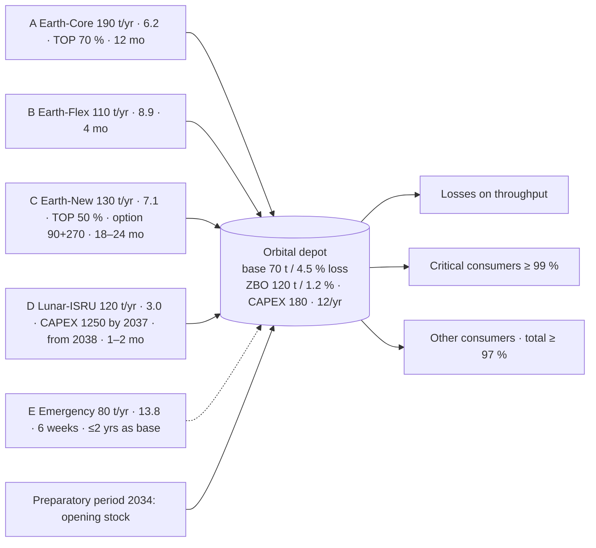

# TerraPlan — calculation architecture

Conceptual model first, then the software implementation (`src/terraplan`). Every block lists inputs, outputs,
formula/algorithm, method source and limits (organizer requirement, criterion 6).

## 1. Supply chain



Critical dependencies: ISRU capacity exists only if 1250 mln is paid by 2037-12; Earth-New capacity only 24 months
after exercise; stress loss ceiling (≤ 2 % from 2038) is met only with ZBO commissioned before 2038.

## 2. Data flow and blocks

```
CASE_INPUT (data/case/*.csv)  +  TEAM_DECISION (plan.json)  +  TEAM_ASSUMPTION (assumptions.yaml)  +  scenario.yaml
        │ load_case / validate          │ load_plan / validate_plan             │ load_assumptions              │ load_scenario
        ▼                               ▼                                       ▼                               ▼
   [1] Investments & availability ──► [2] Delivery schedule ──► [3] Monthly balance ──► [4] Contracts & finance ──► [5] Checks ──► [6] KPI / export / compare
```

| Block | Inputs | Outputs | Formula / algorithm | Source of method | Limits |
|---|---|---|---|---|---|
| 1 Investments & availability | plan.investments, investment_options, storage_options, assumptions (lead-time policy, ZBO lag, ISRU dates) | CAPEX events (date, amount), commissioning month per option, storage mode timeline, first possible delivery month per source | Earth-New: `commissioning = exercise + 24 mo` (max of 18–24); ISRU: `commissioning = 2038-01` if paid ≤ 2037-12, `first delivery = +2 mo`; ZBO: `active from CAPEX month + lag` | case rules §16; organizer FAQ on lead-time ranges | one lead-time policy per run (min/max/mean), no stochastic delays (risk block) |
| 2 Delivery schedule | plan.orders (per source-year, uniform or explicit monthly profile), availability | planned inflow per month per source; order calendar (`delivery_schedule.csv`: delivery month, order placement month, lead time, earliest allowed); lead-time and availability violations | uniform profile spreads `ordered_t` over months ≥ first delivery; order date = delivery − lead time ≥ preparatory start (2034-01) | case §12 timestep & lead time | monthly resolution (6 weeks → 2 months) |
| 3 Monthly balance | planned inflow, scenario delivery shares, storage mode, demand (variant × multipliers) | actual inflow, throughput, losses, served total/critical, shortage, closing stock, holding cost | `actual = planned × share`; `losses = throughput × loss_rate`; `served = min(stock + inflow − losses, demand)`; critical first; `I_end = I_start + inflow − losses − served`; `holding = 0.72 × (I_start+I_end)/2 / 12` | CALCULATION_RULES §1–3, §8 | uniform demand within year; no in-month sequencing beyond "inflow before withdrawal" peak warning |
| 4 Contracts & finance | reservations, orders, prices × scenario multipliers, availability fractions, CAPEX events, OPEX streams | per source-year: reserved period volume, payable volume, procurement, reservation payment; per year: procurement, reservation, holding, fixed OPEX, CAPEX, total, PV | `Q_pay = max(ordered, TOP × reserved × f)`; `reservation = rate × reserved × f`; `PV = total / (1+r)^(y−2035+τ)`, τ = 0 / 0.5 / 1 for start / mid / end-year convention (`discount_timing`, default start) | CALCULATION_RULES §5, §6, §9 | annual TOP period (partial year prorated); no penalties/refunds (separate contract scenarios) |
| 5 Checks | yearly & monthly records, constraints.csv, scenario loss ceiling | violation list (rule id, severity hard / guideline / warning, year, month, source, actual, limit, excess, message) **and** a full check matrix rule × year with passed checks (`constraint_matrix.csv`); catalogue in `docs/constraints_catalogue.md` | service ≥ 0.97/0.99; cumulative CAPEX ≤ 1800 (2037) / 2800 (2040); `I_start(y) ≥ D_y × 45/365`; stock ≤ capacity monthly; reserved ≤ capacity; ordered ≤ reserved × f; Emergency > 20 % of demand ≤ 2 consecutive years; losses/throughput ≤ 2 % from 2038 (stress) | CASE_RULES §8, constraints.csv | Emergency "base channel" threshold 20 % is an assumption; contracted-reserve equivalence rule is an assumption |
| 6 KPI / export / compare | Result | total & PV cost, cost per served tonne, service levels, shortage, losses, CAPEX; CSV/XLSX/JSON; comparison rows | see `export.py`, `compare.py` | organizer export envelope §25 | — |

Planner (`planner.py`) is a helper, not part of the control calculation: greedy merit order (cheapest variable
cost first) fills demand + next-year reserve within reservation caps; the engine re-checks everything.

## 3. Contract and financial architecture (current draft)

| Channel | Contract form | Reservation | Take-or-pay | Lead time / revision window | Liability / risk sharing (draft, TEAM) |
|---|---|---|---|---|---|
| Earth-Core | long-term framework, annual reserved capacity | 0.45 mln per t/yr | 70 % of reserved period volume | 12 months; volumes fixed one year ahead | supplier bears launch-failure replacement (assumption to be contracted); operator bears TOP idle risk |
| Earth-Flex | flexible call-off | 0.15 | 0 % | 4 months; quarterly revision | operator pays premium price for flexibility |
| Earth-New | option (90) + exercise (270), then framework like Core | 0.30 | 50 % after commissioning | 18–24 months preparation | option value = right to add 130 t/yr; exercised 2035-01 in P2z/P4 |
| Lunar-ISRU | pilot financed by operator (1250 by 2037), fixed OPEX 70/yr | 0 | none | first delivery 2038-03 | operator bears under-delivery (no refund in mandatory stress) |
| Emergency | standby contract with reserved capacity | 0.35 | none | 6 weeks; ≤ 2 consecutive years as base | insurance-like; covers 45-day reserve only if stock covers the 6-week wait |

## 4. Software implementation

- Pure Python 3.10+, no numerical libraries; dataclasses; deterministic.
- `simulate(case, plan, scenario, assumptions) -> Result` is the single calculation path used by CLI, exports and (future) UI.
- Plan JSON follows the organizer envelope (`schemas/plan.schema.json`); export JSON follows `schemas/export.schema.json`.
- Extensibility: sources, demand years, investments and constraints are rows in CSV; a new source needs no code (tested in `tests/test_extensibility.py`, `experiments/run_extensibility.py`).
- Reproducibility: `run_manifest.json` stores SHA-256 of inputs and KPIs; two runs with identical inputs yield identical hashes (tested).

## 5. Verification

| Check | Where |
|---|---|
| Organizer vectors V01–V10 | `tests/test_control_cases.py`, `python -m terraplan control-cases` |
| Material balance identity every month, no negative stock | `tests/test_engine.py::test_material_balance_holds_every_month` |
| TOP / reservation payments, proration | `tests/test_engine.py::test_take_or_pay_and_reservation_payments`, `test_partial_year_reservation_is_prorated` |
| Stress multipliers applied to the right years, no double reliability | `tests/test_engine.py::test_stress_applies_exact_multipliers` |
| Boundary & deliberately invalid plans | `tests/test_boundary.py`, `tests/test_invalid_input.py` |
| Export ↔ display parity, plan reopen | `tests/test_export.py` |
| Independent manual example | `docs/manual_check.md` (hand-calculated 2035 for P3) asserted by `tests/test_verification.py::test_manual_hand_check_2035` |
| Independent recalculation from CSV only (no engine import) | `python tests/independent_recalc.py results/<dir>` — monthly identity, yearly sums, TOP/reservation payments from the case CSV, finance totals, PV |
| Reproducibility proof | `python -m terraplan verify results/<dir>` re-runs plan + scenario + assumptions stored in the directory and compares every KPI, yearly row and the KPI hash (precision 1e-6) |
| Golden regression values | `tests/test_verification.py::test_golden_kpis_p3_base` |
| Full check matrix (passed and failed) | `constraint_matrix.csv`, `summary.md` section "Check matrix" |
