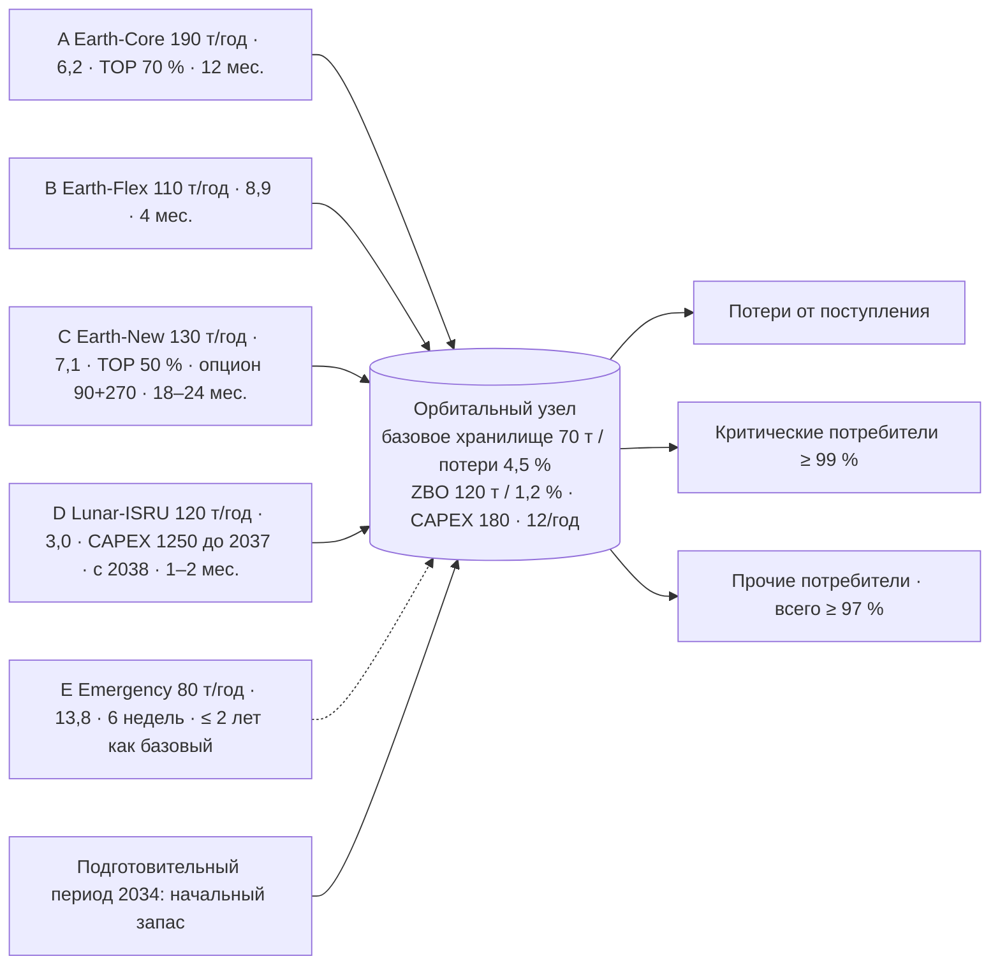

# TerraPlan — архитектура расчёта

Сначала концептуальная модель, затем программная реализация (`src/terraplan`). Для каждого блока перечислены входы, выходы,
формула или алгоритм, источник метода и границы применимости (требование организатора, критерий 6).

## 1. Цепочка поставок



Критические зависимости: мощность ISRU существует только при оплате 1 250 млн до 2037-12; мощность Earth-New — только через 24 месяца
после реализации опциона; потолок потерь в стрессе (≤ 2 % с 2038) достижим только при вводе ZBO до 2038.

## 2. Поток данных и блоки

```
CASE_INPUT (data/case/*.csv)  +  TEAM_DECISION (plan.json)  +  TEAM_ASSUMPTION (assumptions.yaml)  +  scenario.yaml
        │ load_case / validate          │ load_plan / validate_plan             │ load_assumptions              │ load_scenario
        ▼                               ▼                                       ▼                               ▼
   [1] Инвестиции и доступность ──► [2] Календарь поставок ──► [3] Помесячный баланс ──► [4] Контракты и финансы ──► [5] Проверки ──► [6] Показатели / выгрузка / сравнение
```

| Блок | Входы | Выходы | Формула / алгоритм | Источник метода | Границы |
|---|---|---|---|---|---|
| 1 Инвестиции и доступность | plan.investments, investment_options, storage_options, допущения (политика сроков, лаг ZBO, даты ISRU) | события CAPEX (дата, сумма), месяц ввода по каждой опции, график режимов хранилища, первый возможный месяц поставки по источникам | Earth-New: `ввод = реализация + 24 мес.` (максимум диапазона 18–24); ISRU: `ввод = 2038-01`, если оплачено ≤ 2037-12, `первая поставка = ввод + 2 мес.`; ZBO: `действует с месяца CAPEX + лаг` | правила кейса §16; FAQ организатора о диапазонах сроков | одна политика сроков на расчёт (min/max/mean), без случайных задержек (блок рисков) |
| 2 Календарь поставок | plan.orders (по источнику и году, равномерно или явный помесячный профиль), доступность | плановое поступление по месяцам и источникам; календарь заказов (`delivery_schedule.csv`: месяц поставки, месяц размещения заказа, срок, самая ранняя допустимая дата, пояснение `lead_time_note`); нарушения доступности и сроков | равномерный профиль распределяет `ordered_t` по месяцам ≥ первой поставки; дата заказа = поставка − срок заказа ≥ самой ранней допустимой даты. Обычные каналы (A, B, E): срок поставки организатора, заказы с начала подготовительного периода 2034-01. Lunar-ISRU: срок 1–2 мес. после ввода, заказы с месяца ввода. Earth-New: срок 18–24 мес. — подготовка после реализации опциона, поэтому решение о реализации и есть заказ первых поставок; после ввода действует допущение `earth_new_post_commissioning_lead_months` (0). Реактивные заказы (`reactive: true`) не могут быть размещены раньше месяца наблюдения события (`inventory_policy.observation_month`) — проверка сроков реакции | кейс §12 шаг времени и срок поставки | месячное разрешение для календаря (6 недель → 2 месяца); для покрытия контрактного резерва срок берётся в днях (42) |
| 3 Помесячный баланс | плановое поступление, доли фактической поставки из сценария, режим хранилища, спрос (вариант × множители) | фактическое поступление, потери, выдача общая/критическая, дефицит, запас на конец, стоимость хранения | `факт = план × доля`; `потери = поступление × доля потерь`; `выдача = min(запас + поступление − потери, спрос)`; критический спрос первым; `I_end = I_start + поступление − потери − выдача`; `хранение = 0,72 × (I_start+I_end)/2 / 12` | CALCULATION_RULES §1–3, §8 | равномерный спрос внутри года; внутри месяца только предупреждение о пике «поступление до выдачи» |
| 4 Контракты и финансы | резервирования, заказы, цены × множители сценария, доли доступности, события CAPEX, потоки OPEX | по источнику и году: резерв за период, оплачиваемый объём, закупка, плата за резерв; по годам: закупка, резерв, хранение, постоянный OPEX, CAPEX, итого, PV | `Q_pay = max(заказ, TOP × резерв × f)`; `резерв = ставка × резерв × f`; `PV = итого / (1+r)^(y−2035+τ)`, τ = 0 / 0,5 / 1 для конвенции начало / середина / конец года (`discount_timing`, по умолчанию начало) | CALCULATION_RULES §5, §6, §9 | годовой период TOP (неполный год пропорционально); оплачивается заказанный объём даже при недопоставке (правило организатора, зарегистрировано как `undelivered_volume_paid: true`; `false` — оплата по факту, только для исследовательских контрактных сценариев); без штрафов |
| 5 Проверки | годовые и месячные записи, constraints.csv, потолок потерь сценария | список нарушений (правило, строгость hard / guideline / warning, год, месяц, источник, факт, лимит, превышение, сообщение на русском) **и** полная матрица правило × год с выполненными проверками (`constraint_matrix.csv`); каталог — `docs/constraints_catalogue.md` | сервис ≥ 0,97/0,99; накопленный CAPEX ≤ 1800 (2037) / 2800 (2040); `I_start(y) ≥ D_y × 45/365`; запас ≤ ёмкости помесячно; резерв ≤ мощности; заказ ≤ резерв × f; Emergency > 20 % спроса ≤ 2 лет подряд; потери/поступление ≤ 2 % с 2038 (стресс) | CASE_RULES §8, constraints.csv | порог «Emergency — базовый канал» 20 % — допущение; правило эквивалентности контрактного резерва — допущение |
| 6 Показатели / выгрузка / сравнение | Result | полные и приведённые затраты, затраты на обслуженную тонну, уровни сервиса, дефицит, потери, CAPEX; CSV/XLSX/JSON; строки сравнения | см. `export.py`, `compare.py` | конверт выгрузки организатора §25 | — |

Построитель планов (`planner.py`) — вспомогательный инструмент, а не часть контрольного расчёта: жадный порядок по цене (сначала
самая дешёвая переменная цена) покрывает спрос и резерв следующего года в пределах лимитов резервирования; движок перепроверяет всё заново.

## 3. Контрактно-финансовая архитектура (текущий черновик)

| Канал | Форма контракта | Резервирование | Take-or-pay | Срок поставки / окно пересмотра | Ответственность / разделение рисков (черновик, TEAM) |
|---|---|---|---|---|---|
| Earth-Core | долгосрочный рамочный, годовая зарезервированная мощность | 0,45 млн за т/год | 70 % объёма резерва за период | 12 месяцев; объёмы фиксируются за год | поставщик несёт замену при аварии запуска (допущение, подлежит контрактованию); оператор несёт риск простоя TOP |
| Earth-Flex | гибкий вызов объёмов | 0,15 | 0 % | 4 месяца; квартальный пересмотр | оператор платит премию за гибкость |
| Earth-New | опцион (90) + реализация (270), далее рамочный как Core | 0,30 | 50 % после ввода | 18–24 месяца подготовки | ценность опциона = право добавить 130 т/год; реализован 2035-01 в P2z/P4 |
| Lunar-ISRU | пилот, финансируемый оператором (1 250 до 2037), постоянный OPEX 70/год | 0 | нет | первая поставка 2038-03 | оператор несёт недопоставку (без возврата в обязательном стрессе) |
| Emergency | резервный контракт с зарезервированной мощностью | 0,35 | нет | 6 недель; ≤ 2 лет подряд как базовый | страховой характер; покрывает 45-дневный резерв только если запас покрывает 6 недель ожидания |

## 4. Программная реализация

- Чистый Python 3.10+, без численных библиотек; dataclasses; детерминированно (суммы через `math.fsum`, результат побитово одинаков между версиями Python).
- `simulate(case, plan, scenario, assumptions) -> Result` — единственный расчётный путь для CLI, выгрузок, программного интерфейса и (будущего) UI.
- `terraplan.api` — интерфейс «словарь → словарь» для UI и внешних вызовов: `run_plan(план, сценарий, ...)` возвращает словарь результата
  (`result.json`) с `ok=True` либо `{ok: False, error: {code, type, message}}` без исключений наружу; `compare_runs`, `list_scenarios`,
  `list_plans`, `case_summary`, `assumptions_table`. Ошибки ввода называют файл, поле и значение (формат организатора §26).
- Всё, что видит оператор и жюри (CLI, `summary.md`, сообщения о нарушениях и ошибках, лист README в XLSX), — на русском; идентификаторы
  правил, имена файлов и колонок — английские (схемы организатора `schemas/plan.schema.json`, `schemas/export.schema.json`).
- Расширяемость: источники, годы спроса, инвестиции и ограничения — строки CSV; новый источник не требует кода
  (проверено в `tests/test_extensibility.py`, `experiments/run_extensibility.py`).
- Воспроизводимость: `run_manifest.json` хранит SHA-256 входов и показателей; два расчёта с одинаковыми входами дают одинаковые хеши;
  `python -m terraplan verify <каталог>` пересчитывает любой выгруженный каталог по его собственным plan/scenario/assumptions.

## 5. Верификация

| Проверка | Где |
|---|---|
| Контрольные примеры организатора V01–V10 | `tests/test_control_cases.py`, `python -m terraplan control-cases` |
| Тождество материального баланса каждый месяц, запас не отрицателен | `tests/test_engine.py::test_material_balance_holds_every_month` |
| Платежи TOP / резервирования, пропорция неполного года | `tests/test_engine.py::test_take_or_pay_and_reservation_payments`, `test_partial_year_reservation_is_prorated` |
| Множители стресса применены к нужным годам, без повторного учёта надёжности | `tests/test_engine.py::test_stress_applies_exact_multipliers` |
| Граничные и намеренно неисполнимые планы | `tests/test_boundary.py` |
| Ошибочный ввод: сообщение с файлом, полем и значением; код выхода CLI 3; допуск округления помесячного профиля | `tests/test_invalid_input.py` |
| Согласованность исполнимости, списка нарушений и матрицы проверок для всех сохранённых планов в BASE и STRESS | `tests/test_verification.py::test_check_matrix_agrees_with_violation_list` |
| Календарь заказов Earth-New (реализация 2035-01 + 24 мес. → первая поставка 2037-01, заказы после ввода не помечаются) | `tests/test_verification.py::test_earth_new_order_calendar_is_consistent` |
| Исправления по итогам независимого разбора критериев 1–6: строка матрицы STORAGE_OVERFLOW в году переключения ZBO, строки EMERGENCY_BASE_STREAK для каждого года серии, покрытие контрактного резерва 42 дня, реактивные заказы и месяц наблюдения, переключатель оплаты недопоставленного объёма, начальный запас против мощности | `tests/test_review_fixes.py` |
| Паритет выгрузки и отображения, повторное открытие плана | `tests/test_export.py` |
| Программный интерфейс (файл и словарь дают одинаковые показатели, структурированные ошибки, переопределения, сравнение) | `tests/test_api.py` |
| Независимый ручной пример | `docs/manual_check.md` (2035 год для P3 вручную), утверждения в `tests/test_verification.py::test_manual_hand_check_2035` |
| Независимый пересчёт только по CSV (без импорта движка) | `python tests/independent_recalc.py results/<каталог>` — месячное тождество, годовые суммы, платежи TOP/резерв из CSV кейса, итоги финансов, PV |
| Доказательство воспроизводимости | `python -m terraplan verify results/<каталог>` — пересчёт по сохранённым plan + scenario + assumptions и сравнение каждого показателя, годовых строк и хеша (точность 1e-6) |
| Все 34 закоммиченных каталога `results/` пересчитываются, проходят независимый пересчёт и открываются как планы | `tests/test_results_reproduce.py` (параметризовано по каталогам), шаг CI «Verify every committed result directory» |
| Эталонные значения регрессии | `tests/test_verification.py::test_golden_kpis_p3_base` |
| Полная матрица проверок (выполненные и нарушенные) | `constraint_matrix.csv`, раздел «Матрица проверок» в `summary.md` |
